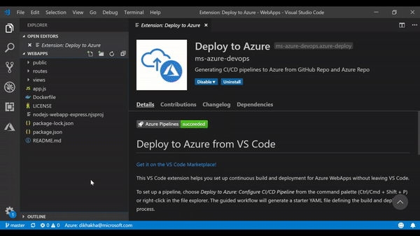

# Deploy to Azure from VS Code

[Get it on the VS Code Marketplace!]()

This VS Code extension helps you set up continuous build and deployment for Azure WebApps without leaving VS Code.

To set up a pipeline, choose *Deploy to Azure: Configure CI/CD Pipeline* from the command palette (Ctrl/Cmd + Shift + P) or right-click in the file explorer. The guided workflow will generate a starter YAML file defining the build and deploy process.

You can customize the pipeline using all the features offered by [Azure Pipelines.](https://azure.microsoft.com/services/devops/pipelines/) 

Once the setup is completed, an automatic CI/CD trigger will fire for every code push. To set this up, the extension will ask for a GitHub PAT with *repo* and *admin:repo_hook* scope.

## Telemetry

VS Code collects usage data and sends it to Microsoft to help improve our products and services. Read our [privacy statement](https://go.microsoft.com/fwlink/?LinkID=528096&clcid=0x409) to learn more. If you don’t wish to send usage data to Microsoft, you can set the `telemetry.enableTelemetry` setting to `false`. Learn more in our [FAQ](https://code.visualstudio.com/docs/supporting/faq#_how-to-disable-telemetry-reporting).

## Troubleshooting failures

- **Failed to determine Azure Repo details from remote url**: If you're configuring a pipeline for a Git repository backed by Azure Repos, ensure that it has a remote pointing to a valid Azure Repos Git repo URL.

# Contributing

See [CONTRIBUTING.md](CONTRIBUTING.md) if you want to jump in!